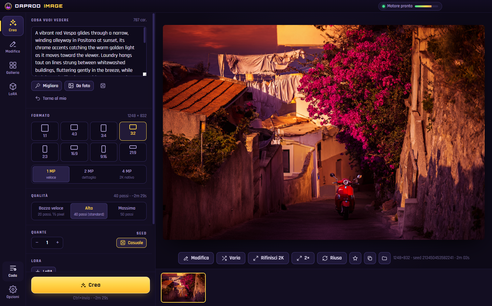
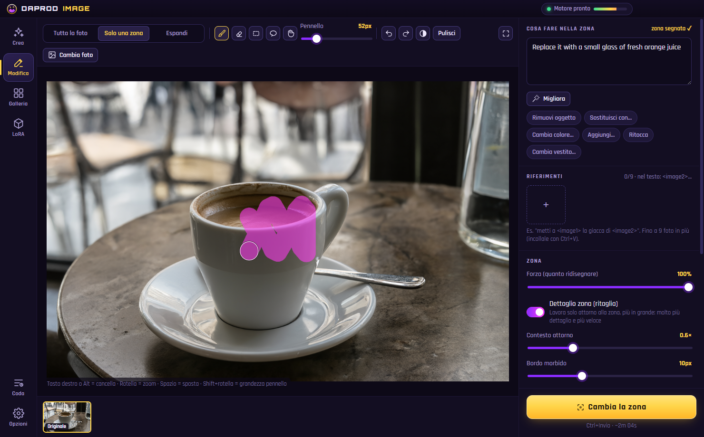
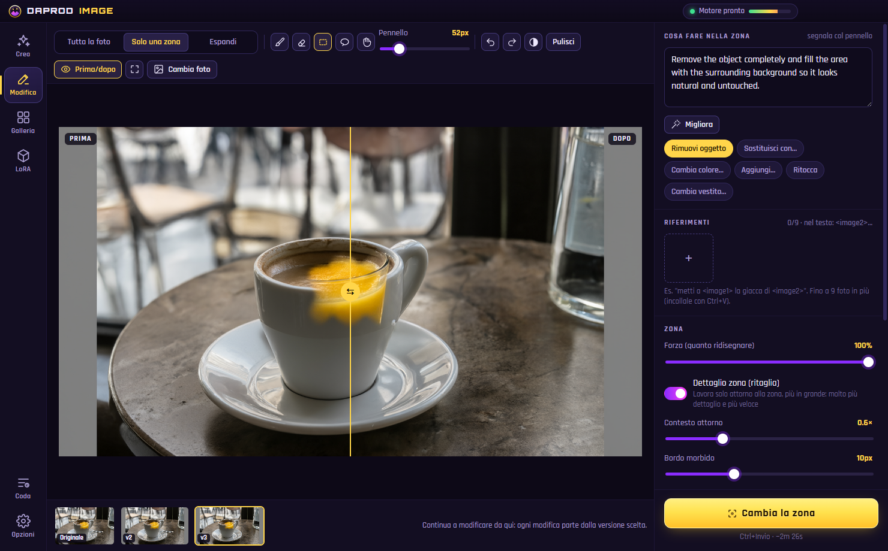
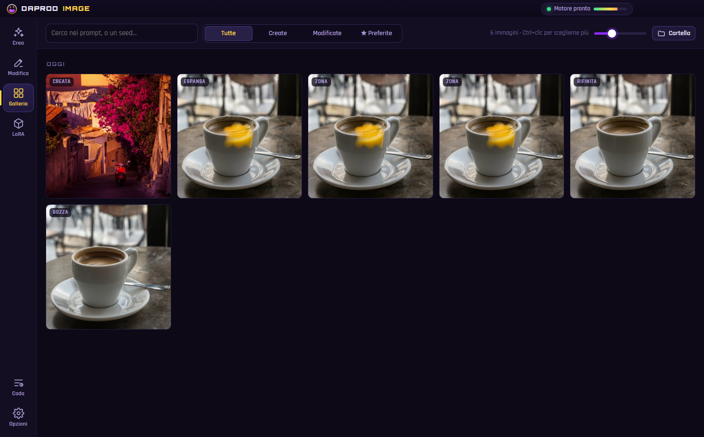
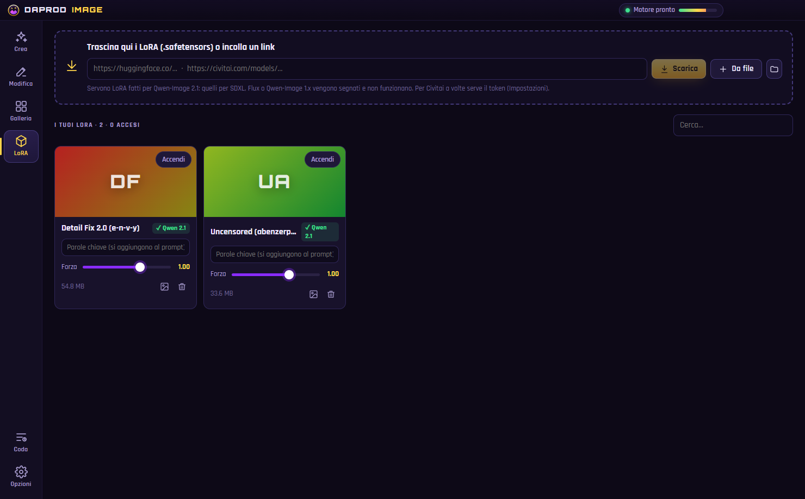

# DaProd · Image 🎨

[](https://github.com/cammo22/DaProdImage/releases/latest)
[](CHANGELOG.md)
[](https://www.electronjs.org/)
[](https://huggingface.co/Qwen/Qwen-Image-2.1)
[](LICENSE)

**Qwen-Image-2.1 sul tuo PC**, con una scheda NVIDIA da **8 GB**. Crei immagini dal testo, **modifichi le foto**
(tutta la foto con una frase, o **solo la zona che segni col pennello**: il resto resta identico al pixel), le
**allarghi oltre i bordi**, le **rifinisci in 2K**, accendi i **LoRA con un clic** e ritrovi tutto in **galleria**,
con dentro ogni PNG le impostazioni per rifarlo.

Gira con il modello [Qwen-Image-2.1 Uncensored GGUF](https://huggingface.co/abenzerps/Qwen-Image-2.1-Uncensored-GGUF)
(Q4_K_M consigliato per 8 GB) e i **passi standard della pipeline ufficiale** (40, euler, CFG 1) per la qualità piena.



| Solo una zona: la segni col pennello | Rimuovi oggetto, con prima/dopo |
| --- | --- |
|  |  |

| Galleria (le impostazioni stanno dentro ogni PNG) | LoRA con un clic |
| --- | --- |
|  |  |

## ▶ Come si installa

1. Scarica **`DaProd-Image-Setup-x.y.z.exe`** dalle [release](https://github.com/cammo22/DaProdImage/releases/latest) e installalo.
2. Al primo avvio l'app controlla il PC (scheda, VRAM, RAM, disco) e **trova da sola il GGUF** se l'hai già scaricato
   (in Download, Desktop o Documenti): lo usa senza riscaricarlo.
3. Premi **Installa e inizia**: scarica il motore (ComfyUI + PyTorch CUDA, ~4 GB) e i file che mancano (text encoder
   Qwen3-VL 8B, VAE Texture-Fix, 4x-UltraSharp), controllando ogni file con lo sha256. Se si interrompe, riparte da lì.

Serve: Windows 10/11, NVIDIA (serie 20 o più nuova, driver aggiornati), **16 GB di RAM o più** (32+ consigliati), ~30 GB liberi.

## ✨ Cosa fa

| Pagina | |
| --- | --- |
| **Crea** | Testo → immagine, formati da 1:1 a 21:9, da 1 a **4 MP (2K nativo)**. **Migliora** riscrive il prompt (anche in italiano) in un paragrafo ricco; **Da foto** trasforma una foto in prompt. Sfondo **trasparente** (PNG con alfa nativo). Più immagini in coda con seed diversi. |
| **Bozza veloce** | 20 passi a metà pixel per esplorare tante idee in poco tempo, poi **Rifinisci** porta la bozza scelta alla grandezza piena ridisegnando i dettagli. |
| **Modifica** | **Tutta la foto**: una frase ("fallo di notte"), azioni rapide (rimuovi sfondo, restaura, colora, luce da studio, stili…), **fino a 9 foto di riferimento** (`<image2>`…). **Solo una zona**: pennello, gomma, rettangolo, lazo; si lavora solo attorno alla zona e più in grande (molto più dettaglio), poi si incolla con il bordo sfumato. **Espandi**: allarga la foto (16:9, 9:16, quadrata, +25%). Ogni risultato è una nuova **versione**, con **prima/dopo**. |
| **Galleria** | Per giorno, ricerca nei prompt, preferite, visore con tutte le impostazioni, **Riusa**, **Varia**, **Rifinisci 2K**, **Ingrandisci 2×/4×**, confronto con l'originale, trascina fuori le immagini. |
| **LoRA** | Trascina i `.safetensors` o incolla un link **Hugging Face / Civitai**; clic sulla carta = acceso. Forza, parole chiave (aggiunte da sole al prompt), copertina, e il controllo che sia davvero un LoRA per Qwen-Image 2.1. |
| **Coda** | Un lavoro dopo l'altro, con anteprima dal vivo, fase, tempo che manca, annulla. |

## ⚙ Come funziona dentro

- Il motore è **ComfyUI** (versione fissata), senza la sua interfaccia, installato con **uv** in `%LOCALAPPDATA%\DaProdImage`.
- **ComfyUI-GGUF** viaggia dentro l'app: è il fork di leejet (l'unico che conosce `qwen_image21`) con una nostra
  correzione per ComfyUI 0.39 (vedi `engine/custom_nodes/ComfyUI-GGUF/DAPROD.md`).
- Su 8 GB: il GGUF Q4_K_M sta in VRAM, il text encoder Qwen3-VL lavora dalla RAM, la cache KV di Qwen 2.1 usa lo spazio libero.
  Su una RTX 4060: ~3 s per passo a 1 MP, un'immagine da 40 passi in ~2 minuti.

## 🛠 Per sviluppare

```bash
npm install
npm run prendi-uv
npm run dev
```

`npm run typecheck`, `npm run build`, `npm run dist` (installer in `dist/`). Le regole del progetto sono in [CLAUDE.md](CLAUDE.md).

## Licenze

App: MIT. Qwen-Image 2.1: Qwen Research License. ComfyUI: GPL-3.0. ComfyUI-GGUF: Apache-2.0. 4x-UltraSharp: CC-BY-NC-SA 4.0.
Texture-Fix VAE: Qwen Research License. Il modello "Uncensored" non ha filtri: quello che generi è responsabilità tua.
