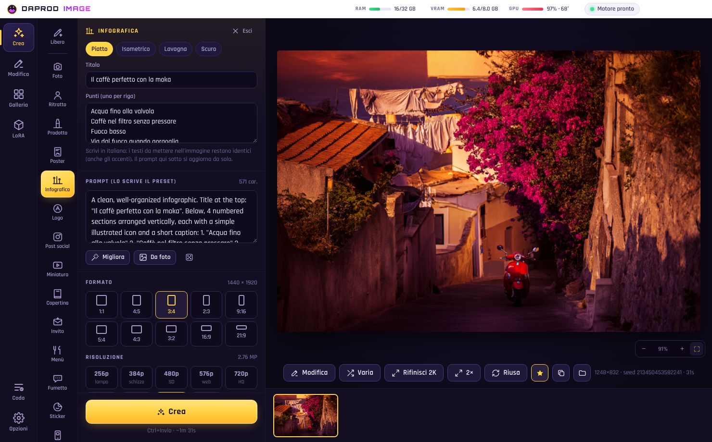
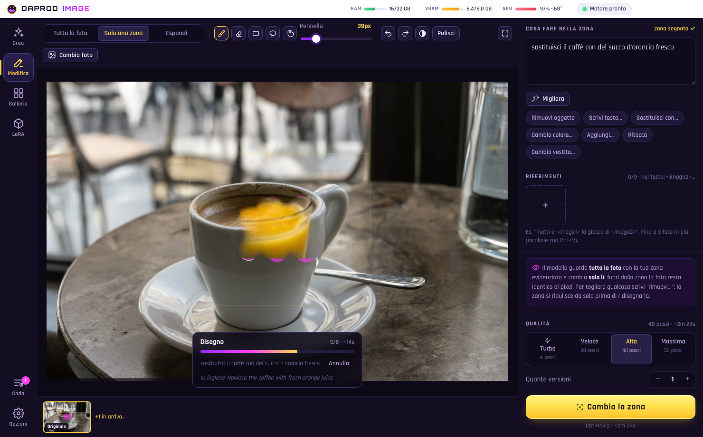

<div align="center">


# DaProd Image

**Qwen-Image 2.1 sul tuo PC. Scrivi, segna, fatto.**

Crei immagini dal testo, anche **poster, infografiche, loghi e fumetti** con i testi scritti giusti.
Modifichi le foto con una frase, o **solo la zona che segni col pennello**: il resto resta identico al pixel.
Gira su una scheda NVIDIA **da 6-8 GB**, senza cloud e senza abbonamenti.

[](https://github.com/cammo22/DaProdImage/releases/latest)
[](#requisiti)
[](#requisiti)
[](https://github.com/QwenLM/Qwen-Image-2.1)
[](#come-funziona-dentro)
[](LICENSE)


**[⬇ Scarica per Windows](https://github.com/cammo22/DaProdImage/releases/latest)** ·
[Tutte le versioni](https://github.com/cammo22/DaProdImage/releases) ·
[Novità](CHANGELOG.md)

</div>

---

<div align="center">

</div>

## Installare

1. Dalla **[ultima versione](https://github.com/cammo22/DaProdImage/releases/latest)** scarica
   `DaProd-Image-Setup-x.y.z.exe` e aprilo. Se Windows SmartScreen avvisa (l'app non è firmata):
   *Ulteriori informazioni → Esegui comunque*.
2. Al primo avvio l'app guarda il PC (scheda, VRAM, RAM, disco) e **trova da sola il modello** se l'hai già
   scaricato (in Download, Desktop o Documenti): lo usa senza copiarlo.
3. **Installa e inizia**: scarica il motore (ComfyUI + PyTorch CUDA, ~4 GB) e i file che mancano (text encoder
   Qwen3-VL, VAE Texture-Fix, 4x-UltraSharp, il decoder delle anteprime), controllando ognuno con lo sha256.
   Se si interrompe, riparte da lì.

Gli **aggiornamenti** arrivano da soli: l'app li scarica in sottofondo (solo i pezzi cambiati) e propone
**Riavvia e aggiorna**. Motore, modelli, galleria e LoRA restano dove sono; se serve, il motore si aggiorna da solo.

## Crea

Scrivi cosa vuoi vedere, **anche in italiano**: il prompt si traduce da solo in inglese, la lingua che
Qwen-Image capisce meglio. I testi fra virgolette, quelli da scrivere nell'immagine, restano identici, accenti compresi.

- **I preset a sinistra**: Foto, Ritratto, Prodotto, **Poster**, **Infografica**, **Logo** (sfondo trasparente),
  Post social, Miniatura YouTube, Copertina, Invito, **Menù**, **Fumetto**, Sticker, App, Slide, Arte. Ognuno mette
  formato e risoluzione giusti, chiede due o tre cose in italiano, ha i suoi stili e scrive il prompt da solo.
- **Risoluzioni da 256p al massimo**: 256p per un'idea in pochi secondi, poi 480p, 720p, 1K, 1080p, 1440p (per i
  testi piccoli) e MAX, i 4,2 MP del 2K nativo. Formati da 1:1 a 21:9, compresi 4:5 e 9:16.
- **Turbo**: 8 passi invece di 40 col LoRA di distillazione Turbo8, circa 5 volte più veloce. Si scarica con un clic.
- **Migliora** riscrive il prompt in un paragrafo ricco; **Da foto** trasforma una foto in prompt.
- **Bozza → Rifinisci**: esplori tante idee a metà pixel, poi porti quella giusta in alta qualità.

| I preset: infografica, poster, menù… | La galleria, a righe con le proporzioni vere |
| --- | --- |
|  |  |

## Modifica

- **Tutta la foto** con una frase ("fallo di notte con la neve"), azioni rapide (rimuovi sfondo, restaura, colora
  il bianco e nero, luce da studio, cambia o traduci i testi, stili) e **fino a 9 foto di riferimento** (`<image2>`…).
- **Solo una zona**: la segni con pennello, rettangolo o lazo e scrivi cosa farci. Il modello guarda **tutta la foto**
  con la zona evidenziata e cambia **solo lì**: fuori, la foto resta identica al pixel. Niente cursori da regolare:
  bordi e sfumatura si adattano alla zona, e se scrivi "rimuovi…" la zona si ripulisce prima di ridisegnarla.
- **La vedi nascere al suo posto**: l'anteprima dal vivo si posa sulla foto, nitida a ogni passo.
- **Espandi**: allarga la foto oltre i bordi (16:9, 9:16, quadrata, +25%).
- Ogni risultato è una **versione**: continui a modificare da lì, passi da una all'altra, tieni premuto per vedere
  com'era prima, confronti con la linea da trascinare, torni indietro.

| Segni la zona e scrivi cosa farci | …e la vedi cambiare mentre lavora |
| --- | --- |
|  |  |

## E poi

- **Galleria**: per giorno, ricerca nei prompt, preferite, visore con zoom a rotella e tutte le impostazioni,
  **Riusa**, **Varia**, **Rifinisci 2K**, **Ingrandisci 2×/4×**. Le impostazioni stanno dentro ogni PNG: trascini
  un'immagine fatta con DaProd Image e torna con prompt, seed e LoRA.
- **Ogni foto entra come PNG**: JPG, WEBP, AVIF, HEIC, TIFF, i RAW delle fotocamere, girata per il verso giusto.
- **LoRA con un clic**: trascini i `.safetensors` o incolli un link Hugging Face / Civitai, l'app controlla che
  siano davvero per Qwen-Image 2.1, aggiunge le parole chiave al prompt.
- **La barra in alto** dice sempre quanta RAM e VRAM stai usando e quanto lavora la scheda video.

## Requisiti

- Windows 10 o 11, scheda **NVIDIA** serie 20 o più nuova con i driver aggiornati, **da 6 GB di VRAM** (8 consigliati).
- **16 GB di RAM** o più (32 consigliati), circa **30 GB** liberi sul disco.

**Ci mette minuti per una foto?** Quasi sempre è la VRAM finita: Windows continua nella RAM del PC e tutto va 5-10
volte più piano senza dare errori. Nel *Pannello di controllo NVIDIA → Gestisci impostazioni 3D* metti
*Criterio di fallback della memoria di sistema CUDA* su **Preferisci nessun fallback**, poi usa il **Turbo** e,
se la scheda è da 6 GB, il profilo **6 GB** in Opzioni. L'app ti avvisa da sola quando va troppo piano.

## Come funziona dentro

- Il motore è **ComfyUI** a una versione fissata, senza la sua interfaccia, installato con **uv** in
  `%LOCALAPPDATA%\DaProdImage`. Il modello è [Qwen-Image 2.1 Uncensored GGUF](https://huggingface.co/abenzerps/Qwen-Image-2.1-Uncensored-GGUF)
  (Q4_K_M per 6-8 GB) con i passi della pipeline ufficiale (40, euler, CFG 1).
- **ComfyUI-GGUF** viaggia dentro l'app: il fork di leejet, l'unico che conosce `qwen_image21`, con una nostra
  correzione per ComfyUI 0.39 (`engine/custom_nodes/ComfyUI-GGUF/DAPROD.md`). I **DaProd-Nodi** riempiono la zona
  prima di "rimuovi" e accordano i colori dopo il VAE, così l'incollaggio non si vede.
- Anteprime dal vivo con **TAEQI 2.1** di madebyollin; traduzione dei prompt con lo stesso Qwen3-VL che legge il
  prompt, quindi senza modelli in più; foto convertite con WIC di Windows, come in [DaP Convertitore](https://github.com/cammo22/DaP-Convertitore).
- Su una RTX 4060: circa 3 secondi per passo a 1 MP, un'immagine da 40 passi in circa 2 minuti, col Turbo in circa 30 secondi.

## Sviluppare

```bash
npm install
npm run prendi-uv
npm run dev
```

`npm run typecheck`, `npm run build`, `npm run dist` (installer in `dist/`). Una versione nuova si pubblica da sola
quando su `main` arriva un `version` nuovo in `package.json`. Le regole del progetto sono in [CLAUDE.md](CLAUDE.md).

## Licenze

App: MIT. Qwen-Image 2.1 e Texture-Fix VAE: Qwen Research License. ComfyUI: GPL-3.0. ComfyUI-GGUF: Apache-2.0.
4x-UltraSharp: CC-BY-NC-SA 4.0. TAESD/TAEQI: MIT. Turbo8: vedi la sua [pagina](https://huggingface.co/chriswritescode/Turbo8-LoRA-Qwen-Image-2.1).
Il modello "Uncensored" non ha filtri: quello che generi è responsabilità tua.
